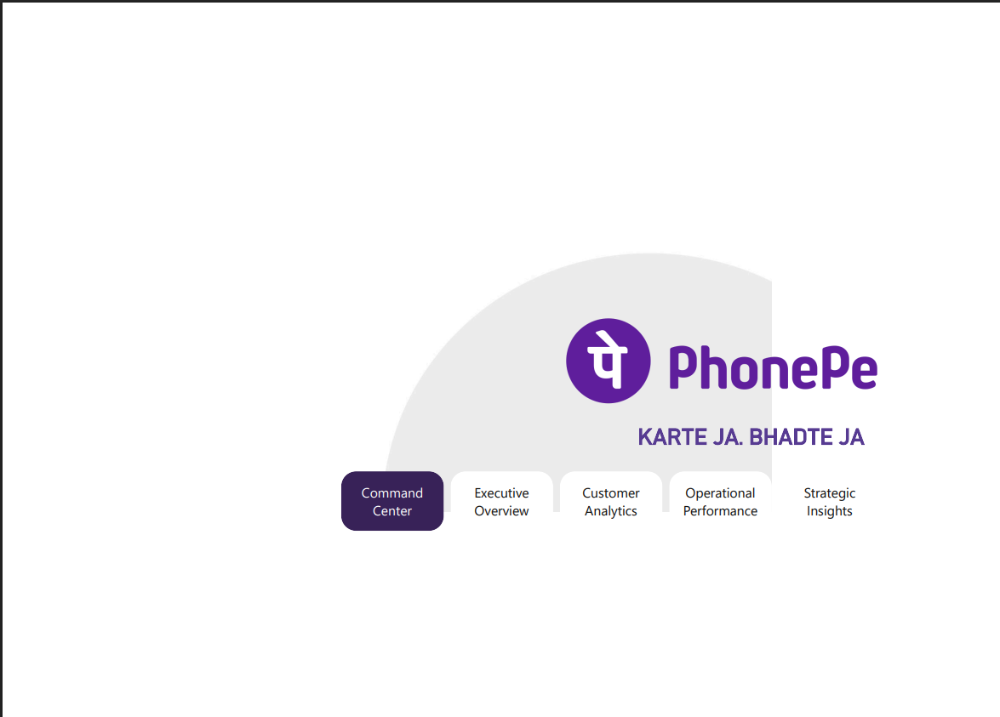

# 💳 Digital Payment – PhonePe Analytics Dashboard

## 📌 Project Overview

This project presents an **interactive Power BI dashboard** designed to analyze **PhonePe digital payment transactions and user data across India**.

The dashboard delivers insights into **transaction performance, user growth, service adoption, and regional trends**, built in a **corporate, portfolio-ready format** suitable for recruiters and stakeholders.

---

## 🎯 Project Objectives

- Analyze **transaction amount and volume** across states and years  
- Identify **top-performing and low-performing regions**  
- Understand **user growth and adoption patterns**  
- Design a **professional Power BI dashboard** for business decision-making  

---

## ⭐ Key Highlights

- **Total Transaction Value:** ₹3.47B  
- **Total Transactions:** ~300K  
- **Total Users:** ~101K  
- **Overall Success Rate:** ~96%  
- **Growth Peak:** March (₹30.46M MoM)  
- **VIP Segment:** Age group 26–35 with ₹18.1K average transaction value  
- **Market Signal:** 0% YoY user growth indicates platform maturity  

---

## 🛠 Tools & Technologies

- **Power BI Desktop**
- **DAX (Data Analysis Expressions)**
- **Data Modeling**
- **Data Visualization & Dashboard Design**

---

## 📊 Dashboard Pages & Explanation

### 🔹 Control Centre (Home)

Acts as the **central navigation hub** for the entire PhonePe dashboard.  
Provides quick access to all major analysis pages ensuring smooth user experience.

---

### 🔹 Strategic Overview

Offers a **high-level view of business performance** including:
- Month-on-Month (MoM) growth  
- Peak transaction month  
- Year-on-Year (YoY) user growth  
- Overall transaction success rate  

Helps stakeholders quickly assess **business health and trends**.

---

### 🔹 Customer Intelligence

Focuses on **customer behavior and demographics**, including:
- Average customer age  
- Total unique users  
- Transactions per user  
- Age-group-wise transaction distribution  
- Monthly user trends  

Supports deeper understanding of **user engagement patterns**.

---

### 🔹 Service Performance

Evaluates **PhonePe service efficiency and adoption**, covering:
- Revenue distribution by service type  
- UPI transaction channel flow  
- Monthly transaction trends  
- Loan success rate  
- Average transaction value  

Helps identify **high-performing services and operational strengths**.

---

### 🔹 Business Insights

Delivers **actionable insights** to support strategic decisions:
- Total bills & transfer volume  
- Transaction success rate  
- Service-wise contribution analysis  

Enables **data-driven planning and optimization**.

---

## 📈 Key Business Insights Summary

| Insight | Business Meaning | Dashboard Pages |
|------|------------------|----------------|
| Millennials drive high value | 56% higher average transaction size | Strategic Overview, Customer Intelligence |
| Insurance shows strong growth | March peak at ₹30.46M | Service Performance |
| 0% YoY user growth | Indicates a mature & saturated market | Strategic Overview |
| Loan success at 100% | Strong operational reliability | Customer Intelligence |

---

## 👤 Author

**Samarth Harde**  
🎓 Data Analyst | Power BI | SQL | Python  

---

## 📌 Note

This project is created for **learning, portfolio presentation, and analytical demonstration purposes** using publicly available PhonePe-style datasets.
